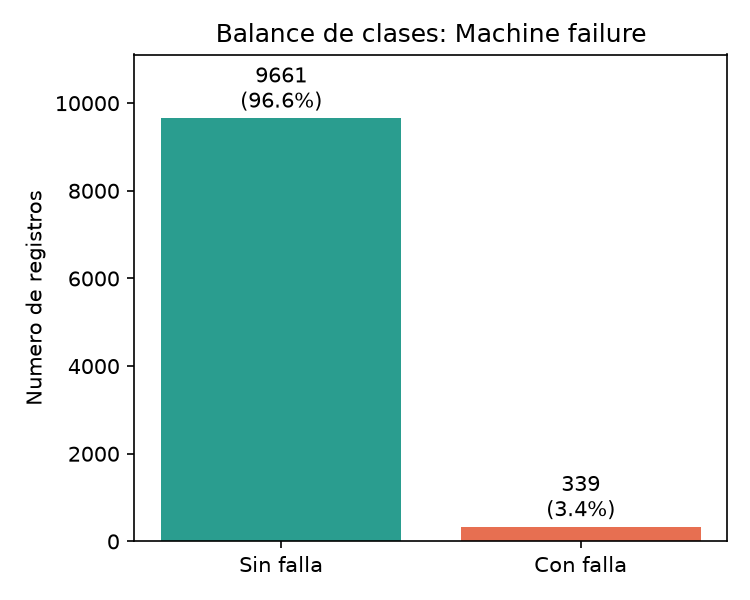
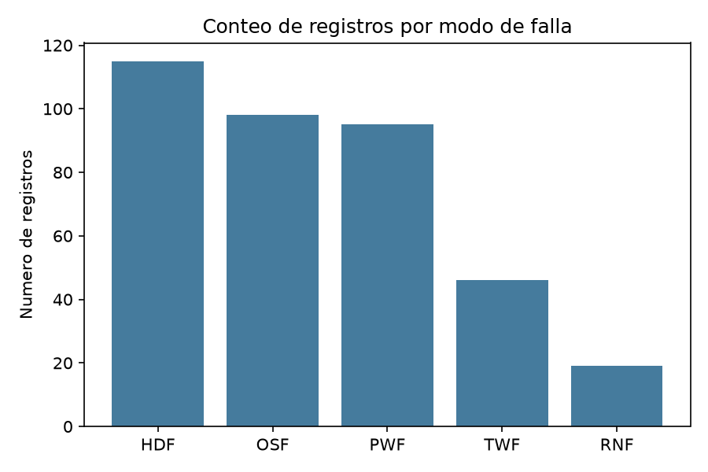
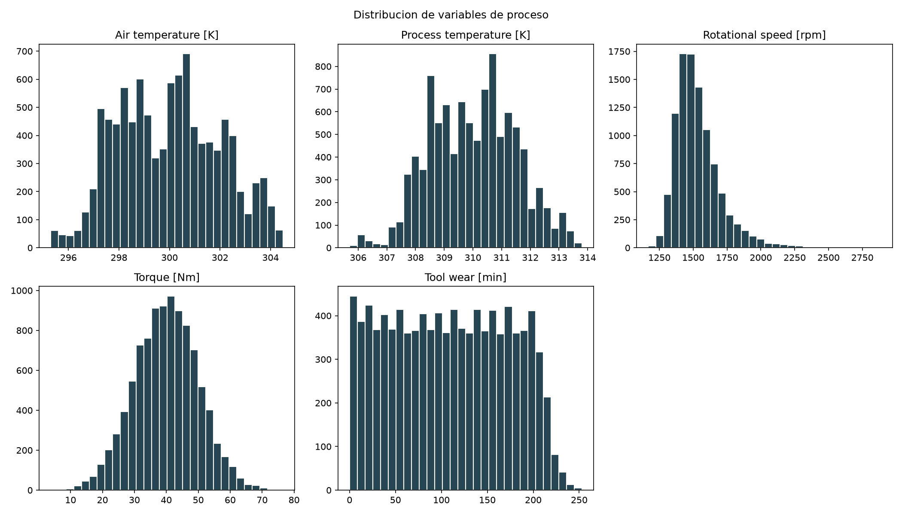
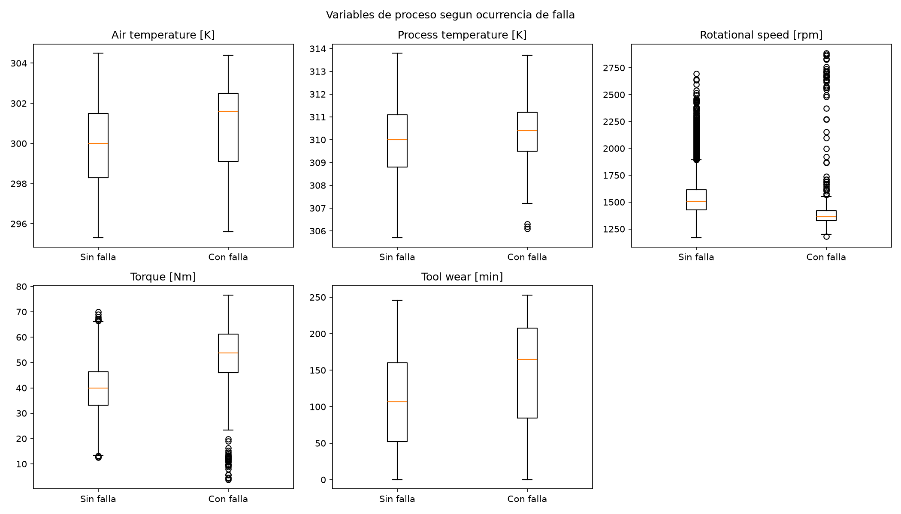
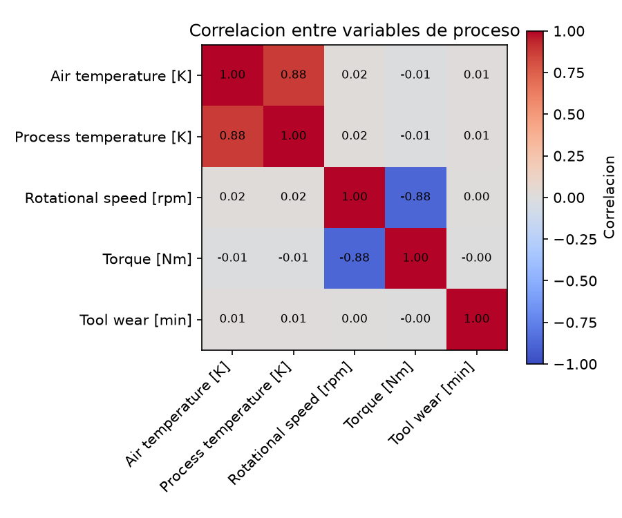

# Informe de Análisis Exploratorio de Datos (EDA)

**Proyecto:** Mantenimiento Predictivo de Maquinaria Industrial
**Dataset:** AI4I 2020 Predictive Maintenance (UCI, CC BY 4.0)
**Autor:** Jorge Iván González (rama `feature/eda-jigg`)

## 1. Datos generales

- 10.000 registros, 14 columnas, sin valores nulos.
- Variables de proceso: `Air temperature [K]`, `Process temperature [K]`, `Rotational speed [rpm]`, `Torque [Nm]`, `Tool wear [min]`.
- Variable de tipo de producto (`Type`): L (bajo), M (medio), H (alto) — 6.000 / 2.997 / 1.003 registros respectivamente. La mayoría de las piezas fabricadas son de calidad baja.

## 2. Balance de clases

| Clase | Conteo | Porcentaje |
|---|---|---|
| Sin falla | 9.661 | 96.61% |
| Con falla | 339 | 3.39% |

El dataset está fuertemente desbalanceado (~3.4% de fallas). **Esto implica que la métrica de éxito del modelo no debe ser accuracy** (un modelo que siempre prediga "sin falla" ya tendría 96.6% de accuracy sin ser útil); se deben usar F1, recall y PR-AUC de la clase falla, como ya se definió para el proyecto.

## 3. Modos de falla

| Modo | Conteo |
|---|---|
| HDF (falla por disipación de calor) | 115 |
| OSF (falla por sobrecarga) | 98 |
| PWF (falla de potencia) | 95 |
| TWF (falla por desgaste de herramienta) | 46 |
| RNF (falla aleatoria) | 19 |

HDF es el modo de falla más frecuente; RNF el menos frecuente (por definición, es ruido aleatorio no asociado a ninguna variable de proceso).

## 4. Distribución de variables de proceso

| Variable | Media | Desv. estándar | Mín | Máx |
|---|---|---|---|---|
| Air temperature [K] | 300.00 | 2.00 | 295.3 | 304.5 |
| Process temperature [K] | 310.01 | 1.48 | 305.7 | 313.8 |
| Rotational speed [rpm] | 1538.78 | 179.28 | 1168 | 2886 |
| Torque [Nm] | 39.99 | 9.97 | 3.8 | 76.6 |
| Tool wear [min] | 107.95 | 63.65 | 0 | 253 |

Las temperaturas siguen una forma aproximadamente normal con leve multimodalidad. Rotational speed y Torque muestran asimetría (cola derecha e izquierda respectivamente). Tool wear es prácticamente uniforme entre 0 y ~200 minutos, cayendo después (herramientas se reemplazan antes de superar ese desgaste).

## 5. Variables de proceso según ocurrencia de falla

| Variable | Sin falla (media) | Con falla (media) |
|---|---|---|
| Air temperature [K] | 299.97 | 300.89 |
| Process temperature [K] | 310.00 | 310.29 |
| Rotational speed [rpm] | 1540.26 | 1496.49 |
| Torque [Nm] | 39.63 | 50.17 |
| Tool wear [min] | 106.69 | 143.78 |

Los registros con falla muestran, en promedio, **mayor torque** (+10.5 Nm), **mayor desgaste de herramienta** (+37 min) y **menor velocidad rotacional** (-44 rpm) que los registros sin falla. Esto es consistente con la física del proceso: a menor velocidad, se requiere más torque para mantener la potencia, lo que sumado a herramientas más desgastadas incrementa la probabilidad de falla.

## 6. Correlaciones entre variables

Se observan dos pares fuertemente correlacionados: `Air temperature` y `Process temperature` (r=0.88, esperable físicamente), y `Rotational speed` y `Torque` (r=-0.88, consistente con Potencia ≈ Torque × Velocidad angular constante). El resto de variables no muestran correlación relevante entre sí.

## 7. Conclusiones para el modelado

- El fuerte desbalance de clases (3.4%) obliga a evaluar con F1/recall/PR-AUC de la clase falla, no con accuracy.
- Torque y Tool wear parecen ser las variables más informativas para distinguir fallas; Rotational speed también aporta señal (relación inversa).
- La alta colinealidad entre `Rotational speed`/`Torque` y entre las dos temperaturas es información útil para el modelo, aunque TabPFN-v2 maneja esto internamente sin necesitar selección manual de variables.
- RNF (fallas aleatorias) no debería ser predecible a partir de las variables de proceso, ya que por definición es ruido; vale la pena mencionarlo en la sustentación si el modelo tiene bajo desempeño en ese modo específico.
