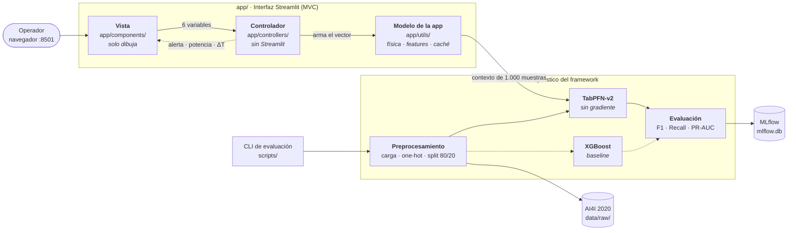

<div align="center">

# Mantenimiento Predictivo con TabPFN-v2

**Estimación de la probabilidad de falla en maquinaria industrial a partir de sus variables operativas**

[](https://www.python.org/)
[](https://docs.astral.sh/uv/)
[](https://streamlit.io/)
[](https://www.docker.com/)
[](https://mlflow.org/)

[](#pruebas-y-calidad)
[](https://docs.astral.sh/ruff/)
[](.specify/memory/constitution.md)
[](LICENSE)

</div>

---

## Tabla de contenidos

- [Contexto](#contexto)
- [Arquitectura](#arquitectura)
- [Estructura del proyecto](#estructura-del-proyecto)
- [Stack técnico](#stack-técnico)
- [Instalación](#instalación)
- [Uso](#uso)
- [Ejecución con Docker](#ejecución-con-docker)
- [Pruebas y calidad](#pruebas-y-calidad)
- [Resultados](#resultados)
- [Análisis exploratorio](#análisis-exploratorio-eda)
- [Desarrollo dirigido por especificación](#desarrollo-dirigido-por-especificación)
- [Estado del proyecto](#estado-del-proyecto)
- [Equipo](#equipo)
- [Licencia](#licencia)

---

## Contexto

### El problema

En una planta industrial, una parada no programada cuesta mucho más que un mantenimiento preventivo. El reto es anticipar la falla: decidir, a partir de las lecturas actuales de una máquina, si conviene intervenir **antes** de que se detenga.

Este proyecto resuelve esa decisión como un problema de **clasificación binaria**. A partir de seis variables —tipo de producto, temperatura del aire, temperatura del proceso, velocidad de rotación, torque y desgaste de herramienta— el sistema devuelve la probabilidad de falla y la traduce en un semáforo operativo de tres niveles.

### Los datos

Se usa el dataset [AI4I 2020 Predictive Maintenance](https://archive.ics.uci.edu/dataset/601/ai4i+2020+predictive+maintenance+dataset) (UCI, CC BY 4.0): 10.000 registros, 14 columnas, sin valores faltantes.

El hecho determinante es su **desbalance severo: solo 339 registros (3,39%) corresponden a fallas**. Eso condiciona todo lo demás, empezando por la elección de métricas: un modelo que nunca alertara acertaría el 96,6% de las veces siendo completamente inútil.

### El enfoque

El modelo base es **TabPFN-v2**, un transformer preentrenado para datos tabulares que predice *en contexto*: recibe el conjunto de referencia como parte de la llamada y devuelve probabilidades, **sin entrenamiento por gradiente ni búsqueda de hiperparámetros**. Como referencia clásica se contrasta contra un **XGBoost** entrenado desde cero, compensando el desbalance con `scale_pos_weight`.

La solución se expone en una interfaz **Streamlit** organizada según el patrón MVC y se empaqueta con **Docker**.

---

## Arquitectura

> 📐 **[Diagrama interactivo →](docs/arquitectura.html)** — explorable, con temas claro/oscuro, vistas guiadas y exportación a PNG/SVG. Descárgalo y ábrelo en el navegador; GitHub no renderiza HTML en línea.



### Cómo se reparten las responsabilidades

| Capa | Ubicación | Responsabilidad |
|---|---|---|
| **Vista** | `app/components/` | Solo dibuja. Recibe valores ya resueltos; no invoca funciones de dominio ni calcula nada. |
| **Controlador** | `app/controllers/` | Coordina: formulario → vector → inferencia → valores para la vista. No importa Streamlit, y por eso se prueba sin levantar la interfaz. |
| **Modelo (app)** | `app/utils/` | Dominio de la interfaz: física, umbrales de alerta, construcción del vector y caché del clasificador. |
| **Modelo (núcleo)** | `src/` | Carga y validación del dataset, preprocesamiento, modelos y evaluación. No sabe que existe Streamlit. |

### Decisiones que sostienen el diseño

- **Una sola fuente de verdad para el orden de las features.** `app/utils/preprocessing.NOMBRE_FEATURES` se deriva de `src.preprocessing.preprocess` en vez de repetir la lista. Un test procesa una misma fila por ambos caminos y falla si divergen.
- **El umbral de alerta se aplica al renderizar, no al predecir.** Mover el slider recalcula el semáforo sobre la misma probabilidad, sin repetir una inferencia que toma 1-2 s en CPU.
- **El contrato entre capas está testeado.** Un test compara con `inspect.signature` las claves que produce el controlador contra los parámetros que declara la vista.
- **TabPFN no se entrena.** Se usa `fit_context()`, que solo registra el conjunto de referencia. La interfaz fija 1.000 muestras estratificadas para mantener la latencia baja.

---

## Estructura del proyecto

```text
.
├── app/                      # Interfaz Streamlit (patrón MVC)
│   ├── components/           #   Vista: formulario, resultados, ajustes
│   ├── controllers/          #   Controlador: coordinación de la predicción
│   ├── utils/                #   Modelo de la app: física, preprocesamiento, caché
│   └── main.py               #   Entrypoint de Streamlit
├── src/                      # Núcleo agnóstico del framework
│   ├── preprocessing/        #   Carga, one-hot de Type, split estratificado
│   ├── models/               #   TabPFN-v2 y baseline XGBoost
│   └── evaluation/           #   Métricas de la clase falla y tracking MLflow
├── tests/
│   ├── unit/                 #   Pruebas unitarias
│   └── integration/          #   Pruebas de extremo a extremo
├── EDA/                      # Análisis exploratorio: script, tablas, figuras, informe
├── scripts/                  # Entrypoints ejecutables
├── specs/                    # Especificaciones spec-kit por incremento
├── docs/                     # Diagrama de arquitectura interactivo
├── data/raw/                 # Dataset AI4I 2020 (no versionado)
├── .specify/memory/          # Constitución del proyecto
├── Dockerfile                # Imagen de producción (python:3.12-slim + uv)
├── Makefile                  # Atajos de desarrollo (`make help`)
├── LICENSE                   # MIT, más los términos de terceros
└── pyproject.toml            # Dependencias y configuración de Ruff/pytest
```

---

## Stack técnico

| Componente | Herramienta |
|---|---|
| Modelo base | TabPFN-v2 (`tabpfn>=8.5.0`) |
| Baseline clásico | XGBoost (`xgboost>=3.2.0`) |
| Dataset | AI4I 2020 Predictive Maintenance (UCI) |
| Procesamiento | pandas · NumPy · scikit-learn |
| Visualización | matplotlib |
| Interfaz | Streamlit |
| Contenedor | Docker (`python:3.12-slim` + uv 0.12.3) |
| Gestión de entorno | uv |
| Pruebas | pytest · pytest-cov |
| Calidad | Ruff (lint + formato) · pre-commit |
| Seguimiento de experimentos | MLflow (backend SQLite) |

> **Sobre los baselines.** GradientBoosting quedó descartado: XGBoost ya cumple el rol de referencia clásica, y añadir un segundo modelo de la misma familia no aportaría evidencia nueva.

---

## Instalación

**Requisitos:** [uv](https://docs.astral.sh/uv/) y Python 3.12.

```bash
# 1. Clonar el repositorio
git clone https://github.com/julicapa15/ProyectoDDPIA_MantenimientoPredictivoIA.git
cd ProyectoDDPIA_MantenimientoPredictivoIA

# 2. Crear el entorno e instalar dependencias exactas desde uv.lock
uv sync
```

No hace falta activar el entorno: todos los comandos van prefijados con `uv run`.

Para añadir dependencias, usa siempre `uv add <paquete>` (o `uv add --dev <paquete>`), nunca `pip install`.

### Dataset

El CSV no se versiona. Descarga [AI4I 2020](https://archive.ics.uci.edu/dataset/601/ai4i+2020+predictive+maintenance+dataset) y colócalo en:

```text
data/raw/ai4i2020.csv
```

La carga valida que tenga exactamente 10.000 filas, las 14 columnas originales y ningún nulo. Si algo no cuadra, falla con un mensaje explícito en lugar de seguir adelante con datos dudosos.

### Licencia de TabPFN-v2

TabPFN descarga sus pesos tras una aceptación de licencia única en [ux.priorlabs.ai](https://ux.priorlabs.ai). Sin ella, sus pruebas se omiten automáticamente en lugar de fallar.

> **En Windows** el flujo interactivo falla con `OSError: [WinError 10038]`: la librería usa `select()` sobre `stdin`, que en Windows solo admite sockets. Genera una API key en [ux.priorlabs.ai/account](https://ux.priorlabs.ai/account) y expórtala antes de ejecutar:
>
> ```powershell
> $env:TABPFN_TOKEN = "tu_api_key"
> ```

### Si el repositorio vive en OneDrive

OneDrive no soporta enlaces duros y `uv` puede fallar con `os error 396`. Se resuelve una sola vez:

```powershell
setx UV_LINK_MODE copy
```

---

## Uso

### Interfaz web

```bash
uv run streamlit run app/main.py        # o: make app
```

Disponible en `http://localhost:8501`. Ingresa las seis variables, presiona **Predecir falla** y obtienes:

- un **semáforo** de tres niveles (Normal / Precaución / Falla inminente),
- la **probabilidad** de falla,
- la **potencia mecánica** y el **ΔT** derivados de las lecturas,
- el vector de 8 features que realmente recibió el modelo.

El slider lateral ajusta la sensibilidad de la alerta entre 35% y 90%: más sensible detecta fallas con menor probabilidad a costa de más falsas alarmas.

### Evaluación de modelos

```bash
uv run python -m scripts.evaluar_modelos                 # o: make evaluar
uv run python -m scripts.evaluar_modelos --sin-tabpfn    # solo el baseline
```

Corre el pipeline completo, imprime la comparativa y registra ambos runs en MLflow. Acepta `--spec-id` y `--experimento` para asociar los runs a la feature correcta.

### Interfaz de MLflow

```bash
uv run mlflow ui --backend-store-uri sqlite:///mlflow.db --port 5000   # o: make mlflow
```

### Análisis exploratorio

```bash
uv run python EDA/eda.py
```

Genera cuatro tablas en `EDA/` y cinco figuras en `EDA/figures/`.

### Atajos disponibles

`make help` los lista todos. Los más usados:

| Comando | Qué hace |
|---|---|
| `make app` | Lanza la interfaz Streamlit |
| `make test` | Ejecuta las 146 pruebas |
| `make coverage` | Pruebas con reporte de cobertura |
| `make check` | Lint + verificación de formato |
| `make evaluar` | Evalúa ambos modelos y registra en MLflow |
| `make docker-build` / `make docker-run` | Construye y ejecuta el contenedor |

---

## Ejecución con Docker

La imagen instala las dependencias en una capa separada del código, de modo que un cambio en `app/` o `src/` no obliga a reinstalar TabPFN, XGBoost y PyTorch. Corre como usuario sin privilegios, fija la versión de `uv` para que dos builds del mismo commit sean idénticos, e incluye un `HEALTHCHECK` contra el endpoint de salud de Streamlit.

El dataset **no se hornea en la imagen**: se monta como volumen, igual que en desarrollo local.

```bash
# Construir
docker build -t mantenimiento-predictivo .

# Ejecutar montando el dataset y pasando la API key de TabPFN
docker run -p 8501:8501 \
  -v "$(pwd)/data:/app/data" \
  -e TABPFN_TOKEN="tu_api_key" \
  mantenimiento-predictivo
```

En PowerShell, sustituye `$(pwd)` por `${PWD}`.

---

## Pruebas y calidad

```bash
uv run pytest                                               # 146 pruebas
uv run pytest tests/unit/ -v                                # solo unitarias
uv run pytest --cov=src --cov=app --cov-report=term-missing # con cobertura
uv run ruff check . && uv run ruff format --check .         # lint y formato
uv run pre-commit run --all-files                           # todos los hooks
```

Las pruebas que dependen de TabPFN se omiten automáticamente si no hay licencia aceptada, en vez de romper la suite.

### Convenciones verificadas

- **Estructura AAA obligatoria.** Todo test se escribe en tres bloques separados por línea en blanco, encabezados por los comentarios literales `# 1. ARRANGE (...)`, `# 2. ACT (...)` y `# 3. ASSERT (...)` con su descripción. Sin excepciones: los tests que verifican errores capturan la excepción con `as excinfo` y afirman sobre su mensaje en el bloque ASSERT.

  ```python
  def test_archivo_inexistente_lanza_error(tmp_path):
      # 1. ARRANGE (Ruta a un archivo que no existe)
      ruta = tmp_path / "no_existe.csv"

      # 2. ACT (Intentar cargar un archivo que no está en disco)
      with pytest.raises(FileNotFoundError) as excinfo:
          load_raw_data(ruta)

      # 3. ASSERT (El mensaje nombra la ruta que falta)
      assert "no_existe.csv" in str(excinfo.value)
  ```

- **Docstrings Google obligatorios.** Toda función, método y clase pública documenta `Args:`, `Returns:` y `Raises:`. Lo hace cumplir Ruff (`select = ["D"]`, `convention = "google"`): el build falla si falta una sección.
- **Pre-commit** ejecuta Ruff en cada commit, más validación de TOML/YAML y limpieza de espacios.

---

## Resultados

Clasificación binaria de `Machine failure`. Split estratificado 80/20 con `random_state=42`; métricas medidas sobre los 2.000 registros de prueba (68 fallas reales), siempre sobre la clase falla.

| Modelo | F1 | Recall | PR-AUC |
|---|:---:|:---:|:---:|
| **TabPFN-v2** | **0,825** | **0,765** | **0,880** |
| XGBoost | 0,729 | 0,750 | 0,837 |

**TabPFN-v2 supera al baseline en las tres métricas**, sin entrenamiento por gradiente y sin ajuste de hiperparámetros: solo aprendizaje en contexto. XGBoost compite de cerca en recall (0,750 frente a 0,765) tras compensar el desbalance con `scale_pos_weight = 28,52`.

> **Por qué no se usa accuracy como criterio de éxito.** Con 3,39% de fallas, un modelo que nunca alertara alcanzaría 96,6% de accuracy siendo inútil. El proyecto decide con F1, Recall y PR-AUC de la clase falla. Accuracy se calcula y se registra en MLflow únicamente como dato de contraste que evidencia ese problema.

Cada run queda registrado con el tag `spec_id` de su feature, la licencia y el repositorio del modelo, el hash del dataset, el entorno de ejecución, la latencia de inferencia, predicciones de ejemplo, un reporte de evaluación y el modelo empacado en formato nativo.

---

## Análisis exploratorio (EDA)

Informe completo con tablas y figuras en **[EDA/informe_eda.md](EDA/informe_eda.md)**.

Hallazgos que condicionan el modelado:

- **Desbalance severo:** 339 fallas sobre 10.000 registros (3,39%), lo que descarta *accuracy* y justifica F1, Recall y PR-AUC.
- **Modos de falla desiguales:** HDF (115), OSF (98) y PWF (95) concentran los casos; TWF (46) y RNF (19) son marginales.
- **Torque y desgaste son las variables más discriminantes:** en los registros con falla el torque medio sube de 39,6 a 50,2 Nm y el desgaste de 106,7 a 143,8 min, mientras la velocidad baja de 1.540 a 1.496 rpm.
- **Dos pares casi colineales:** las dos temperaturas (r = 0,88) y velocidad con torque (r = −0,88). TabPFN-v2 lo maneja internamente, sin selección manual de variables.
- **RNF es ruido por definición:** no debería ser predecible desde las variables de proceso, y conviene tenerlo presente al interpretar el desempeño por modo de falla.

---

## Desarrollo dirigido por especificación

El proyecto se rige por una **constitución** ([`.specify/memory/constitution.md`](.specify/memory/constitution.md), v1.2.2) con seis principios no negociables: TabPFN sin gradiente, métricas de la clase falla, preprocesamiento mínimo y reemplazable, CRISP-DM como marco de fases, estructura AAA en tests y docstrings Google.

Cada incremento se organiza como una feature de spec-kit con su `spec.md` (qué y por qué), `plan.md` (cómo) y `tasks.md` (tareas ordenadas):

| Feature | Alcance | Estado |
|---|---|:---:|
| [`001-tabpfn-xgboost-baseline`](specs/001-tabpfn-xgboost-baseline/) | Pipeline TabPFN-v2 + baseline XGBoost + MLflow | ✅ |
| [`002-eda-preprocesamiento`](specs/002-eda-preprocesamiento/) | Análisis exploratorio del dataset | ✅ |
| [`003-interfaz-streamlit`](specs/003-interfaz-streamlit/) | Interfaz web y arquitectura MVC | ✅ |

Las desviaciones respecto a lo planeado se documentan en la propia spec en vez de corregirse en silencio. La 002, por ejemplo, incluye una sección de trazabilidad que explica por qué se cerró cubriendo solo el EDA.

### Flujo de trabajo

`main` está protegida y contiene únicamente el commit de estructura inicial; **`develop` es la rama de integración**. El trabajo ocurre en ramas de feature y entra por Pull Request contra `develop`, con mensajes en formato `tipo: descripción breve` (`feat`, `fix`, `chore`, `docs`, `test`, `refactor`).

---

## Estado del proyecto

| Fase | Estado |
|---|:---:|
| Estructura del repositorio | ✅ |
| Carga y exploración del dataset | ✅ |
| Preprocesamiento y split estratificado | ✅ |
| Modelo base TabPFN-v2 | ✅ |
| Baseline XGBoost | ✅ |
| Evaluación, métricas y tracking MLflow | ✅ |
| Interfaz Streamlit (MVC) | ✅ |
| Contenedorización con Docker | ✅ |
| Documentación viva de la arquitectura | ✅ |
| Integración continua | ⏳ |

---

## Equipo

**Universidad Autónoma de Occidente** — Desarrollo de Proyectos en IA

| Integrante |
|---|
| Juliana Campuzano |
| Diego Fernando Garcés |
| Jorge Iván Gonzáles |
| Juan José Mosquera |

---

## Licencia

El código de este proyecto se distribuye bajo licencia **MIT** — ver [LICENSE](LICENSE).

Los componentes de terceros conservan sus propios términos: **TabPFN-v2** bajo licencia de Prior Labs (uso no comercial / académico), **XGBoost** bajo Apache-2.0 y el **dataset AI4I 2020** bajo CC BY 4.0.
